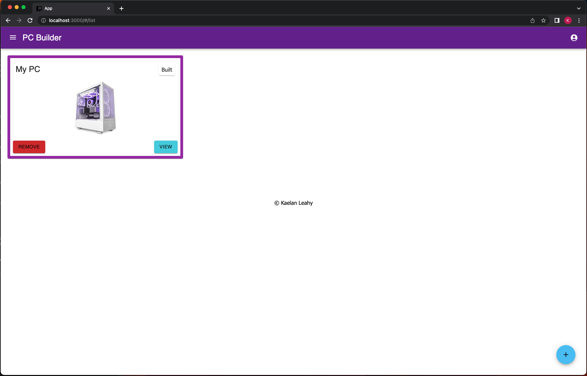
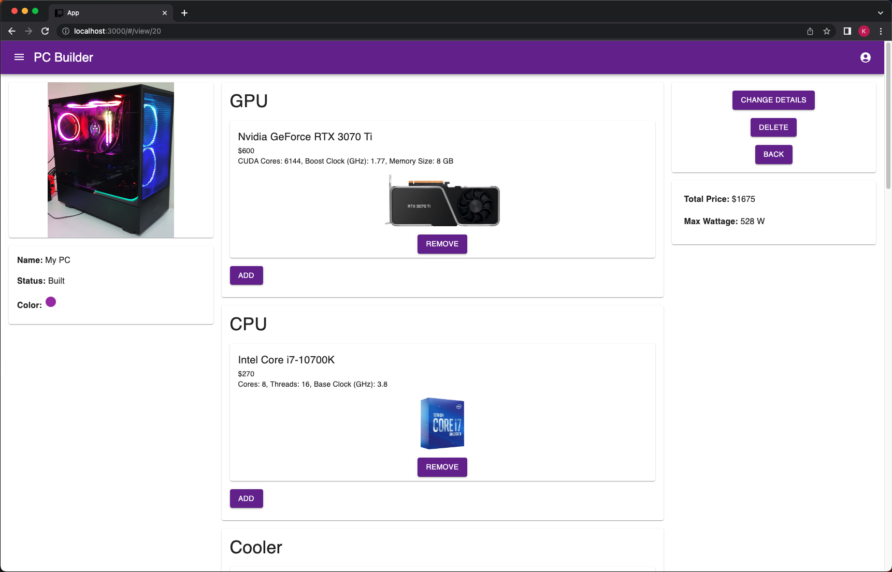

# PC Builder

## Description

_Duration: 3 Week Sprint_

When it comes to making a PC, there is a LOT of information to go through. Picking components and comparing is difficult when there are so many. My site aims to streamline and organize picking all the parts you need to make a PC up and running.

## Screen Shot

### Prerequisites

Link to software that is required to install the app (e.g. node).

- [Node.js](https://nodejs.org/en/)
- Express
- Axios
- React.js
- pg
- Postico
- Postgres

## Installation

1. Create a database named `solo-project`,
2. The queries in the `database.sql` file are set up to create all the necessary tables and populate the needed data to allow the application to run correctly. The project is built on [Postgres](https://www.postgresql.org/download/), so you will need to make sure to have that installed. We recommend using Postico to run those queries as that was used to create the queries, 
3. Open up your editor of choice and run an `npm install`
4. Run `npm run server` in your terminal
5. Run `npm run client` in your terminal
6. The `npm run client` command will open up a new browser tab for you!

## Built With

- Javascript
- Node.js
- React
- Express
- Material UI
- Axios
- Postgres

## Acknowledgement
Thanks to [Prime Digital Academy](www.primeacademy.io) who equipped and helped me to make this application a reality. Thanks to Tanzanite for being a great cohort!
Thanks to my friends and family for their support!

## Support
If you have suggestions or issues, please email me at kaelan@leahyonline.com